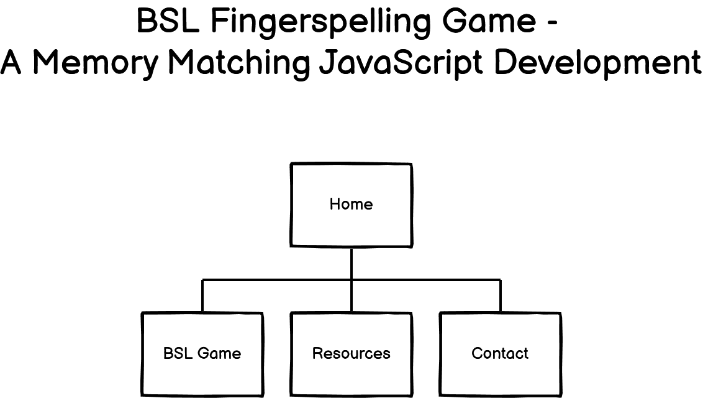

   
   

# British Sign Language Fingerspelling:- An Educational JavaScript Memory Matching Game

*Constructed as part of Code Institute's Milestone 2 Project: Interactive Front-End Development module*

## Table of Contents

1. [Overview](#overview)
2. [User Experience Design (UXD)](#user-experience-design)
   1. [Project Goals](#project-goals)
   2. [Strategy](#strategy)
   3. [Scope](#scope)
      - [Main User Stories](#main-user-stories)
      - [Accessibility User Stories](#accessibility-user-stories)
      - [Features](#features)
   4. [Structure](#structure)
      - [Interaction Design (IXD)](#interaction-design)
      - [Information Architecture](#information-architecture)
      - [Sitemap](#sitemap)
   5. [Skeleton](#skeleton)
      - [Wireframing the Website](#wireframing-the-website)
   6. [Surface](#surface)
      - [Colour Palette](#colour-palette)
      - [Typography](#typography)
3. [Features](#features)
4. [Technologies Utilised](#technologies-utilised)
5. [Project Bugs and Solutions](#)
6. [Testing](#)
7. [Deployment](#)
8. [Credits](#)

# Overview

As I approached the second milestone project, which derives on the learning experience of exploring 
through the fundamentals of JavaScript and the Interactive Front-End Development modules (that focuses 
on jQuery, Application Programming Interfaces (abbreviated as API) and utilising an email JS service), 
attention has now progressively transitioned from a static site to one that will become interactive 
whereby it allows visitors to actively engage with data. It also completes what's known as the 'trinity 
of web development' that forms the basis of front-end development which concerns itself with components 
such as HTML, CSS and the additional insight into JavaScript plus any of its associations.

The core focal point of this project will consist of constructing an interactive front-end website that 
will provide the value of enabling users a sense of engagement and to interact with the data as presented 
in order to achieve their personal goal by responding to their actions actively.

# User Experience Design

## Project Goals

The sole purpose into this website is one that originated through coincidence via a discussion with a 
tutor who had expressed an interest in a subject that relates to oneself personally and was requesting 
some resources into it. This lead to an identifiable moment of inspiration into a conceptual idea towards 
the project in constructing an interactive front-end website which is a reflection of the module learnt.

This had been established to represent a window of opportunity into the development of a memory matching 
game that has an objective of it being educational to the users, specifically aiming to raise awareness 
of deafness as a whole by introducing British Sign Language (abbreviated as BSL). This in my view was an 
excellent idea to utilise the functionality & capability of the JavaScript language that would enable 
users either with a vested interest or as a new interest into a hobby to practise and improve on their 
BSL fingerspelling skills.

## Strategy

The approach into the construction serves as a purpose of demonstrating the knowledge and skills obtained 
within the programming language of JavaScript and jQuery, by way of providing new/returning visitors the 
key to an open door as an introduction, (that is akin to the Code Institute's 5 day coding challenge), 
into the community of the deaf society and how they communicate to one another.

The value in this would be based on the hope to create an impact that influences a positive contribution 
to this community, especially and yet significantly more so under the current times of the pandemic. The 
objective of it is that it encourages potential users to use the social qualities of being considerate 
and thoughtful in the manner of being helpful by engaging to communicate with them to break through the 
social barriers or assisting them in their difficulties.

Also research was undertaken to establish if such a game exists which will form the basis of this project 
and it was with luck that one has been developed through a resourceful website.

To summarise the website project's goals:

* To demonstrate the implementation of acquiring a new knowledge & skill in JavaScript whilst 
supplementing the experience of HTML & CSS to the design & development of the project.
* To provide an interactive educational game to target interested users with the objective of achieving 
in acquiring the knowledge and in addition the ability to fingerspell or action in motion the alphabet in 
BSL as a foundation.
* To construct a game that elicits a positive user experience in a way that it encourages new/returning 
visitors to continue the learning experience in an engaging way that is resourceful to them.

## Scope

### Main User Stories

* As a user, I want to be able to understand with ease into the sole purpose and comprehend the rationale 
as to why the website has been built and developed so I can see if it is relevant or of interest to me.

* As a user, I want to be assured that the website overall and its content can be viewed clearly on a 
range of devices to enable an opportunity to be flexible in my learning.

* As a user, I expect to be given instructions as guidance into the rules which is easily understood as 
to how the game is to be played and the learning outcome of it to experience the benefit of utilising it.

* As a user, I want to comfortably be allowed to commence the game when I am prepared and it is suitably 
convenient to proceed so I can perform this to the best of my ability.

* As a user, when presented, I expect to see a clear image depicting an alphabet in BSL in sequence to 
form a word and have the ability to replicate the sign so that I can be competently confident when 
applying it in the real world to achieve a personal goal.

* As a user, I want to be provided with a resourceful section consisting of content as a guiding reference 
point, that would easily be referred to, assist me when there is a moment of doubt and potentially 
demonstrate it by motion in reality.

* As a user, when I am confident in the knowledge, I want to be able to enter my answer so that the 
experience feels like I am participating in the game.

* As a user, I want the game to determine whether my answer was correct or incorrect and that there is 
clear feedback that is complimentary and encouraging in a positive manner at any stage in the game.

* As a user, I expect to have the opportunity to re-enter my answer when the previous suggestion is 
incorrect to help me acknowledge where I need to make improvement in my learning or memory matching 
abilities.

* As a user, I would like to visually view my score in the current game to gain confidence in the ability 
to learn so that I can assess my competency levels.

* As a user, I expect the game to provide a notification when the time is up so that I can acknowledge 
when my learning or memory matching opportunity has ceased.

* As a user, I expect the game to offer the option to restart, subsequent to the current play mode 
that has finished to allow me to continue my learning and make progress.

* As a user, I would like to access any further resources that would supplement or advance my learning, 
should I wish to dedicate a commitment in making a difference within a community.

* As a user, I expect to be able to access contact details into the owner of the website, should I wish 
to reach out by raising queries, commend the game by providing feedback.

* As a user, I would like to explore other projects that the developer has constructed to assess their 
range of technical skills and level of competency so that I can establish if it is of interest to me.

### Accessibility User Stories

* As a user who uses a screen reader technology, I want this to access most elements and controls, 
especially describing the depicted images without giving away the answer.

### Features

The features which I envisage to incorporate into the project are as follows:

* An introduction that delves into BSL and the purpose of the website

* A BSL Fingerspelling game that aims to be interactively engaging

* Instructions into the game that clearly defines into the usage of how it is to be played

* Various high quality images that depicts a sign of an alphabetic letter for clarity

* The ability to flash each image to form a sequence into a word

* A play button to activate the game

* The option where users can select their appropriate speed level of how slow/fast the images flashes 
through a modal

* A countdown timer that gives users some breathing space prior to commencing the game

* A timer that is based on each word which a user is given as opposed to the overall time allocated to 
complete the game for ease of use

* An interactive message that determines when the word is incorrect when typed in and notifies the user 
by way of a positive/encouraging response yet apply complimentary praise when correct

* A replay button that allows users to review the alphabetic letters as images that has been displayed

* A small area that calculates the score per word which builds up to the total score

* An overview message into the progress of their learning and to provide positive encouragement

These items are above are determined in the below table:

| Item | Description                       | Importance | Viability | Score |
| ---- | --------------------------------- | ---------- | --------- | ----- |
| 1.   | Introduction to BSL & purpose     | 4          | 5         | 9     |
| 2.   | Interactive & engaging BSL game   | 5          | 4         | 9     |
| 3.   | Defining the instructions         | 4          | 5         | 9     |
| 4.   | Obtaining high quality images     | 5          | 5         | 10    |
| 5.   | Flash the sign letter as images   | 5          | 3         | 8     |
| 6.   | Construct a play button           | 4          | 5         | 9     |
| 7.   | Construct speed level             | 3          | 4         | 7     |
| 8.   | Construct a countdown timer       | 4          | 5         | 9     |
| 9.   | Create a timer per word           | 5          | 3         | 9     |
| 10.  | Approve/encourage when typed word | 5          | 4         | 9     |
| 11.  | Construct a replay button         | 5          | 3         | 8     |
| 12.  | Construct game score              | 3          | 4         | 7     |
| 13.  | Construct concluding game message | 4          | 4         | 8     |

## Structure

Retrospectively, it was immediately yet concretely identified in the duration of the planning stage that 
by comparison to the previous milestone project and with some guidance that I had to consider the aim of 
keeping this to a minimalistic design overall, including content to accommodate and focus the attention 
on the sole major development into the interactive yet functional game. The rationale into this 
perspective is that the languages used within this website is an unfamiliar territory to me on approach 
to this milestone project, therefore this journey will be a steep learning curve overall in equal measure 
with the learning experience of the module.

Thus the structure into the JavaScript game project aims to be simple in that it has basic content yet 
will consider a linear narrative approach which is enough I feel to create a function yet resourceful 
method of learning a new skill. The advantage to this is that it reduces the need for the website to be 
majorly responsive across the range of devices, with the exception of the playing game area.

In order to provide a good user experience for new/returning visitors, I feel it would be of great 
benefit to take into consideration of constructing various webpages, again, that would enable content to 
be broken up into sections appropriately for simplicity. Also, intuitively it feels that by doing it this 
way, content can be spread out and gives better flow of information in a logical manner, as opposed to 
developing one page consisting of various sections to optimise the website a bit more.

### Interaction Design

For this particular project, functionality and interactivity becomes a bit more prominent therefore I 
acknowledged the principle within the duration of the design process, whereby I had to consider in keeping 
the concept of the JavaScript game as simple and effective as possible. This reflects the aforementioned 
as above in the structure being basic for the very reason in accommodating the new knowledge and skills to 
utilise the programming languages into the complex world JavaScript and its associative languages or 
technologies such as the lightweight version of jQuery.

Given that Interaction Design (IXD) is concerned with 5 parts that ensures the site is: visible, 
learnable, predictable, that clear and intuitive feedback is provided and consistent throughout, more 
emphasis and consideration can be placed upon these when constructing an interactive JavaScript 
Fingerspelling game.

* Visible:- that the site conveys clarity in all aspect of IXD, especially with the images of the signs
* Learnable:- the content provides a learning experience through supplementary information and resources
* Predictable:- the behaviour of the game offers users functional features as part of an interactive game
* Clear and intuitive feedback:- the message of these are clear and offer a positive experience
* Consistent:- the site gives the impression that it is consistent in design & functionality

Another aspect of my approach into the Interaction Design within the website is the adaption of choice to 
appropriately include modals and these apply to when users: click on the 'Introduction' button that 
allows them to access more information into the subject and purpose of the development, decide when they 
want to find out how to play the memory matching game, the interactive positive/encouraging messages, the 
overall score at the conclusion of the game.

To add further UX to the design of interaction for new/returning visitors, some darker subtle colours will 
be applied to buttons and icons to create a positive appeal and within the footer, an expanding effect 
will be applied when hovered over the social media/contact icons.

### Information Architecture

The structure of the information architecture will be such that it is to consist of 4 webpages in total 
which again, retains the simplicity into the website and as aforementioned to allow the focal point be on 
the development of the JavaScript game.

It will be structured in the form of a simple yet basic hierarchy whereby at the top level will be 'Home', 
and the remainders will be at a level that is horizontally in equal measure such as 'BSL Fingerspelling 
game', 'Resources' and 'Contact'. Within the next section will illustrate this thought process.

#### Sitemap

Below represents how the website will be structured on the basis of the information architecture in the 
form of a sitemap along with details for each of the webpages within the project and illustrates the 
logical thought process into different sections:

- **Home** :- this will include an image of a logo depicting a sign for each letter of BSL, various 
buttons whereby two of these is to produce a modal and the remaining two a link to a webpage respectively. 
Lastly, a footer will be included with icons that links to GitHub, LinkedIn and to 'Contact' webpage.
- **BSL Game** :- it is to consist of the same image as 'Home', a div area in which the game will be 
undertaken, that will contain four modals; firstly to select the game level, a countdown timer, an 
interactive positive/encouraging message and finally a concluding modal for the overall score & to 
restart the game.
- **Resources** :- I plan to provide new/returning visitors with a range of resourceful information to 
supplement their learning or interest with links to various websites.
- **Contact** :- Again, quite simply this will be a contact form that will reset when submitted and the 
message will be sent to my professional email address via EmailJS.

## Skeleton

Taking into consideration of the above Structure plane, the navigation and interface design can commence 
in the form of building the Skeleton of the website through wireframes as provided below:

## Wireframing the website

As part of the planning processes, I was quite satisfied in utilising the software Balsamiq to form a 
blueprint for my JavaScript game website which has considered devices such as mobile, tablet and desktop, 
that can be access as below for each of the webpages:

* **[Theme Template Design](assets/wireframes/template-design-for-all-devices.pdf)**

* **[Homepage](assets/wireframes/homepage-for-all-devices.pdf)**

* **[BSL Fingerspelling game](assets/wireframes/bsl-game-for-all-devices.pdf)**

* **[Resources](assets/wireframes/resources-for-all-devices.pdf)**

* **[Contact](assets/wireframes/contact-for-all-devices.pdf)**

## Surface

Given that the focus is on constructing a game, I thought it was appropriate to research and select bold 
colours that illuminates vibrancy within the palette to convey an psychological element of fun and 
playfulness to reflect the project.

### Colour Palette

Source: [Coolors](https://coolors.co/0f0a0a-f5efed-2292a4-bdbf09-d96c06)

The choice of these generated colours attracted me for its boldness, especially the tone of blue, green 
and orange which I felt would initially work and complemented towards the idea which having alternated 
these within my wireframes, I was satified with my final decision. The focal colours that will be used 
on the website is primarily the fluorescent green and teal whereby #BDBF09 will be used within the main 
content and #2292A4 will be applied to the footer which are both separate elements. 

For the buttons, I thought it was appropriate to use the orange (#D96C06) as a background colour with a 
tone of white (#F5EFED) for the font, which instinctively I had realised accessibility needed to be 
considered for the colour choice thus this was sensibly checked through 
[Accessible Colors](https://accessible-colors.com) and it was advised that as long as the text was in 
bold weight, this was deemed as acceptable. 

Separately, in relation to the modals, I was conscious of not overpowering the background colour by 
utilising the orange (#D96C06) as it may be perceived as a warning alert message, therefore I took the 
sensible decision to have a white (#F5EFED) background, then utilise the orange (#D96C06) for the border 
with a teal (#2292A4) as the font colour. I had intended in wanting to apply the fluorescent green 
(#BDBF09) as the font colour, to give an element of positivity in various messages, however, much to my 
disappointment Accessible Colours deemed this as a fail therefore a blend of black (#0F0A0A) was an 
appropriate alternative which I decided to choose in place of my preference.

### Typography

Bearing in mind that this is a memory matching game, I wanted a creative font for all my headings and 
this would come in the form of a calligraphic style entitled as 'Akaya Telivigala' which is a trending yet 
contemporary typography and I had decided that this would be complemented by 'ABeeZee' which is friendly 
yet one that supports the process of learning.

### Icons

These are going to be provided by [Font Awesome](https://accessible-colors.com) which would be used where 
appropriate yet in moderation such as to activate the game and social media links.

### Imagery

In order to fully engage with the development of JavaScript, I have decided to keep the number of imagery 
to a minimum by simply including a logo to complement the subject of the game.

# Features

# Technologies Utilised

# Credits

## Contents

Context for the introduction into BSL was extracted from the [British Sign](https://www.british-sign.co.uk/) 
website to ensure accurate representation and consistency of information.

## Media

The image logo to represent BSL had been obtained specifically via this webpage
[Essex Local Offer](http://www.essexlocaloffer.org.uk/british-sign-language/).